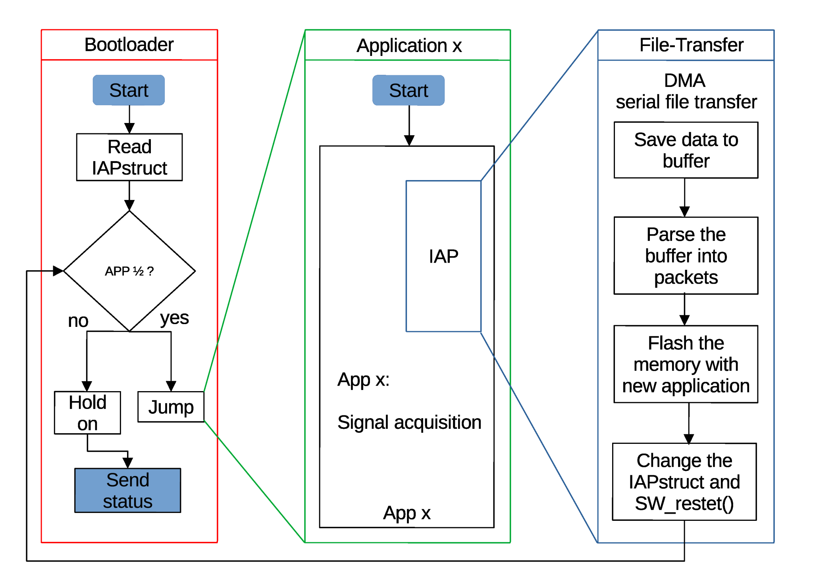

# STM32F446 Application Slot 1 (APP1)

This repository contains the primary application firmware for the STM32F446-based signal acquisition unit, developed as part of a rainwater retention system. The firmware is designed to acquire, process, and transmit sensor data from an underground tank to a central unit via RS-485.

It is tightly integrated with the bootloader and supports in-application programming (IAP), allowing firmware updates to be received and flashed while the application is running.

---

## 🚀 Features

- Acquisition of analog and digital sensor data:
  - Pressure (piezoresistive)
  - Flow (turbine and differential)
  - Temperature (1-Wire DS18B20)
  - Voltage and current sensing
- Signal conditioning and filtering
- RS-485 communication using UART + DMA
- In-application programming (IAP) support
- Bootloader jump compatibility
- CRC validation and watchdog integration (optional)

---

## 🧠 CMSIS LL Driver Usage

- `LL_ADC_REG_StartConversion()`, `LL_ADC_REG_ReadConversionData32()` – ADC sampling
- `LL_USART_TransmitData8()`, `LL_USART_IsActiveFlag_TXE()` – UART transmission
- `LL_DMA_EnableChannel()` – DMA for UART
- `LL_GPIO_IsInputPinSet()` – digital sensor polling
- `LL_FLASH_Program()` – Flash writing during IAP
- `LL_CRC_FeedData32()` – CRC validation

---

## 📁 Project Structure

- `Core/` – Application logic and sensor routines
- `Drivers/` – STM32 LL drivers
- `.ioc` – STM32CubeMX configuration
- `STM32F446RETX_FLASH.ld` – Linker script for App1 memory region
- `docs/` – Diagrams and hardware images

---

## 📊 Application Architecture

### 🧠 Application Flow with IAP

This version supports in-application programming. The application can receive firmware packets via UART or RS485, validate them, and flash a new application image without rebooting into the bootloader.

---

## 🔗 Related Projects

- [STM32F446-Bootloader](https://github.com/Vojtese/STM32F446-Bootloader)
- [STM32F446-APP2](https://github.com/Vojtese/STM32F446-APP2)
- [serial_BIN_file_transfer](https://github.com/Vojtese/serial_BIN_file_transfer)
- [STM32F446-uploadRS485Test](https://github.com/Vojtese/STM32F446-uploadRS485Test)

---

## 🛠️ TODO & Improvements

- [ ] Add support for encrypted firmware packets
- [ ] Improve Flash write buffering and error handling
- [ ] Add LED or UART status feedback during IAP
- [ ] Integrate persistent IAPstruct handling
- [ ] Add fallback to bootloader if IAP fails

---

## 📜 License

This project is licensed under the GNU General Public License v3.0.
